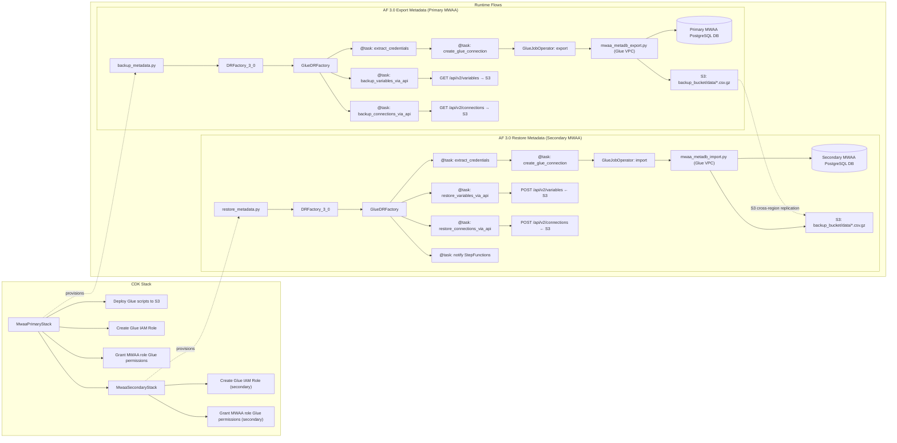
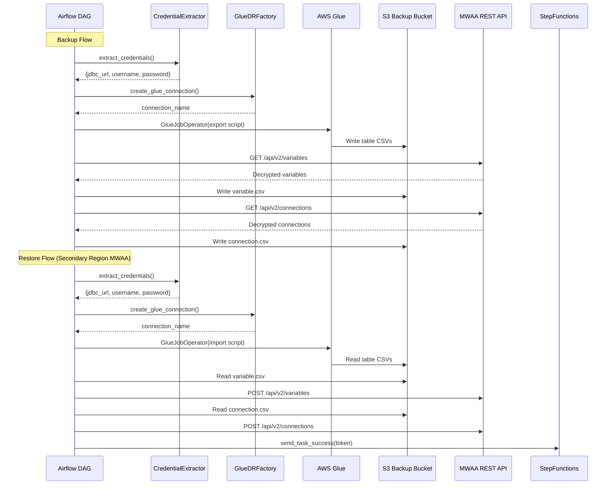
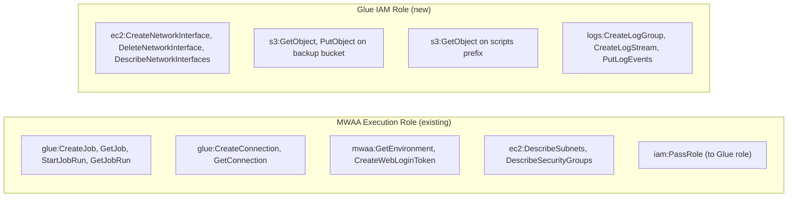

# Design Document: Airflow 3.0 Glue DR Support

## Overview

This feature extends the MWAA Disaster Recovery framework to support Apache Airflow 3.0 by replacing direct ORM database access with AWS Glue jobs for metadata export/import/cleanup, and the MWAA Airflow REST API for Variable and Connection handling.

Airflow 3.0 prohibits direct database access from DAGs (`RuntimeError: Direct database access via the ORM is not allowed in Airflow 3.0`), breaking the existing `BaseTable.backup()` / `BaseTable.restore()` / `BaseDRFactory.cleanup_tables()` methods that use `airflow.settings.Session` and `settings.engine.raw_connection()`. The solution introduces a new `GlueDRFactory` base class and a `DRFactory_3_0` version-specific factory that orchestrate AWS Glue jobs from the DAG instead of performing database operations inline.

Variable and Connection tables require special handling because they contain Fernet-encrypted values. Since each MWAA environment has its own Fernet key, these values must be decrypted via the source environment's REST API during export and re-encrypted via the target environment's REST API during import.

The design preserves full backward compatibility — all Airflow 2.x factories, table models, and DAG entry points remain unchanged.

### Key Design Decisions

1. **Glue over Lambda**: Glue jobs run inside the MWAA VPC with JDBC connectivity to the metadata PostgreSQL database. Lambda would require VPC attachment and custom PostgreSQL drivers with no advantage.
2. **REST API for Variables/Connections**: Fernet-encrypted fields cannot be round-tripped through raw JDBC. The MWAA REST API handles decryption/re-encryption transparently.
3. **GlueDRFactory as a new base class**: Rather than modifying `BaseDRFactory`, a new `GlueDRFactory` class overrides `create_backup_dag()`, `create_restore_dag()`, and `create_cleanup_dag()` to use `GlueJobOperator` and `@task`-decorated functions. This avoids any risk to Airflow 2.x behavior.
4. **Glue scripts deployed via CDK**: The export, import, and cleanup Glue scripts are deployed to S3 by the CDK stack alongside DAGs, leveraging the existing cross-region replication.

## Architecture



### Backup Flow (Airflow 3.0)

1. DAG entry point selects `DRFactory_3_0` based on `airflow.version.version.startswith("3.")`
2. `extract_credentials` task reads `DB_SECRETS`, `POSTGRES_HOST`, `POSTGRES_PORT`, `POSTGRES_DB` from environment
3. `create_glue_connection` task creates/reuses a Glue JDBC connection with MWAA VPC networking
4. `GlueJobOperator` runs the export Glue script, which exports tables to compressed CSV in S3
5. `backup_variables_via_api` and `backup_connections_via_api` tasks use the MWAA REST API to export decrypted values to CSV in S3

### Restore Flow (Airflow 3.0)

1. The restore DAG runs on the secondary region MWAA environment
2. `extract_credentials` task reads the secondary environment's `DB_SECRETS`, `POSTGRES_HOST`, `POSTGRES_PORT`, `POSTGRES_DB` from environment
3. `create_glue_connection` task creates/reuses a Glue JDBC connection to the secondary metadatabase using the secondary MWAA VPC networking
4. `GlueJobOperator` runs the import Glue script, which reads compressed CSV from S3 and writes to the secondary database via JDBC
5. `restore_variables_via_api` and `restore_connections_via_api` tasks use the secondary MWAA REST API to create/update values (re-encrypted by the target environment)
6. StepFunctions task token callback is sent on success/failure

### Cleanup Flow (Airflow 3.0)

1. The cleanup DAG runs on the secondary region MWAA environment (Warm Standby only)
2. `extract_credentials` task reads the secondary environment's database credentials from environment variables
3. `create_glue_connection` task creates/reuses a Glue JDBC connection to the secondary metadatabase
4. `GlueJobOperator` runs the cleanup Glue script, which truncates/deletes metadata tables via JDBC
5. Preserves `default_pool` in `slot_pool` and `SchedulerJob` entries in `job`
6. StepFunctions task token callback is sent on success/failure

## Components and Interfaces

### 1. Credential Extractor (`credential_extractor.py`)

A utility module in `assets/dags/mwaa_dr/framework/` that extracts database credentials from the MWAA worker environment.

```python
class CredentialExtractor:
    """Extracts MWAA metadata database credentials from environment variables."""

    @staticmethod
    def extract() -> "DatabaseCredentials":
        """
        Returns DatabaseCredentials with fields: jdbc_url, username, password, host, port, database

        Strategy:
        1. Try DB_SECRETS (Airflow 3.x) + POSTGRES_HOST/PORT/DB
        2. Fall back to AIRFLOW__DATABASE__SQL_ALCHEMY_CONN (Airflow 2.x)
        3. Fall back to AIRFLOW__CORE__SQL_ALCHEMY_CONN (legacy)
        4. Raise ValueError if none available
        """
```

### 2. GlueDRFactory (`glue_dr_factory.py`)

A new base factory class in `assets/dags/mwaa_dr/framework/factory/` that extends `BaseDRFactory` and replaces PythonOperator-based database tasks with Glue job orchestration.

```python
class GlueDRFactory(BaseDRFactory):
    """Factory that uses AWS Glue jobs for database operations."""

    def __init__(self, dag_id, path_prefix=None, storage_type=None, batch_size=5000):
        super().__init__(dag_id, path_prefix, storage_type, batch_size)

    # --- Overridden DAG creation methods ---
    def create_backup_dag(self) -> DAG: ...
    def create_restore_dag(self) -> DAG: ...
    def create_cleanup_dag(self) -> DAG: ...

    # --- Glue job helpers ---
    def get_glue_role_name(self) -> str: ...
    def get_script_location(self, script_name: str) -> str: ...
    def get_table_definitions(self) -> list[dict]: ...
    def get_table_dependency_order(self) -> list[str]: ...

    # --- REST API helpers ---
    def get_mwaa_rest_api_client(self) -> "MwaaRestApiClient": ...
    def backup_variables_via_api(self, **context): ...
    def backup_connections_via_api(self, **context): ...
    def restore_variables_via_api(self, **context): ...
    def restore_connections_via_api(self, **context): ...
```

### 3. MwaaRestApiClient (`mwaa_rest_api_client.py`)

A utility class in `assets/dags/mwaa_dr/framework/` for interacting with the MWAA Airflow REST API.

```python
class MwaaRestApiClient:
    """Client for MWAA Airflow REST API using web login token authentication."""

    def __init__(self, env_name: str, region: str):
        self.env_name = env_name
        self.region = region

    def _get_web_login_token(self) -> tuple[str, str]:
        """Returns (web_server_hostname, web_token) via CreateWebLoginToken API."""

    def _get_session(self) -> requests.Session:
        """Returns authenticated requests.Session."""

    # Variables
    def list_variables(self) -> list[dict]: ...
    def get_variable(self, key: str) -> dict: ...
    def create_variable(self, key: str, value: str, description: str = None): ...
    def update_variable(self, key: str, value: str, description: str = None): ...
    def delete_variable(self, key: str): ...

    # Connections
    def list_connections(self) -> list[dict]: ...
    def get_connection(self, conn_id: str) -> dict: ...
    def create_connection(self, conn_data: dict): ...
    def update_connection(self, conn_id: str, conn_data: dict): ...
    def delete_connection(self, conn_id: str): ...
```

### 4. DRFactory_3_0 (`v_3_0/dr_factory.py`)

Version-specific factory for Airflow 3.0 that extends `GlueDRFactory` and defines the 3.0 table schema.

```python
class DRFactory_3_0(GlueDRFactory):
    """Factory for Airflow 3.0 metadata schema."""

    def setup_tables(self, model) -> list[BaseTable]:
        """
        Defines Airflow 3.0 tables and dependencies.
        New tables: dag_version, dag_code, asset, asset_event,
                    backfill, backfill_dag_run, dag_run_note,
                    task_instance_note, task_instance_history
        Removed tables: serialized_dag, sla_miss, rendered_task_instance_fields
        """
```

### 5. Glue Scripts (`assets/glue_scripts/`)

Three Python scripts deployed to S3 by CDK:

- `mwaa_metadb_export.py` — Reads tables via JDBC, writes compressed CSV to S3
- `mwaa_metadb_import.py` — Reads compressed CSV from S3, writes to tables via JDBC
- `mwaa_metadb_cleanup.py` — Deletes/truncates metadata tables via JDBC

Each script accepts parameters: Glue connection name, S3 path, table definitions (JSON), and table dependency ordering.

#### Large Table Handling

The Glue scripts run on Apache Spark, which provides distributed processing for large tables. The design avoids the anti-pattern in the reference implementation (`tmp/db_export/scripts/mwaa_metadb_export.py`) which calls `df.toPandas()` — loading the entire table into a single node's memory.

**Export (large table strategy):**
- JDBC reads use `fetchsize=1000` to control database-side memory and cursor batching
- Spark's native `DataFrameWriter` writes directly from the distributed DataFrame to S3 as gzip-compressed CSV — no `toPandas()` conversion
- For tables with a date field, the date filter is pushed down to the JDBC query (`WHERE date_field >= cutoff`) so only relevant rows are read from the database
- Spark handles partitioning and streaming to S3 automatically; output is coalesced to a single partition per table to produce one `.csv.gz` file per table for compatibility with the import script

**Import (large table strategy):**
- Spark's native `DataFrameReader` loads compressed CSV from S3, distributed across workers
- JDBC writes use `batchsize=1000` to batch INSERT statements, reducing round-trips to the database
- Duplicate key handling uses a two-phase approach: attempt batch insert, on constraint violation fall back to row-by-row `INSERT ... ON CONFLICT DO NOTHING` for that batch
- `numPartitions=1` is used for JDBC writes to avoid concurrent write conflicts on the same table

**Cleanup:**
- Cleanup uses direct JDBC `DELETE` statements (not Spark DataFrames) since it's a simple operation — no large data movement involved
- For tables with protected rows (`slot_pool`, `job`), the `DELETE` includes a `WHERE` clause excluding protected records

### 6. CDK Stack Changes

Conditional additions to `MwaaPrimaryStack` and `MwaaSecondaryStack` when `mwaa_version.startswith("3.")`:

- **Glue IAM Role**: New role with VPC networking, S3, and CloudWatch permissions
- **MWAA Role Policy**: Glue, MWAA, EC2 permissions added to the execution role
- **Script Deployment**: Glue scripts deployed to `s3://{dags_bucket}/scripts/`
- **Config**: `GLUE_ROLE_ARN` added as a new configuration property

### Component Interaction Diagram




## Data Models

### Credential Data

```python
@dataclass
class DatabaseCredentials:
    jdbc_url: str       # e.g., "jdbc:postgresql://host:5432/AirflowMetadata"
    username: str
    password: str
    host: str
    port: str
    database: str
```

### Glue Table Definition

The table definitions passed to Glue scripts as JSON job arguments:

```python
@dataclass
class GlueTableDefinition:
    table: str              # Table name, e.g., "dag_run"
    date_field: str | None  # Date column for filtering, None = export all
    columns: list[str]      # Column names for import ordering
    binary_columns: list[str]  # Columns requiring hex decode (e.g., "conf", "executor_config", "value")
    dependency_level: int   # Topological sort level auto-computed from DependencyModel
                            # Import: process levels 0, 1, 2, ... (parent tables first)
                            # Export/Cleanup: process levels in reverse max, ..., 2, 1, 0 (child tables first)
                            # Tables at the same level have no dependency between them and can run in parallel
```

The `dependency_level` is automatically computed by `GlueDRFactory.get_table_dependency_order()` which performs a topological sort on the `DependencyModel` graph. Each table is assigned a level based on its longest path from a root node (a table with no dependencies). The Glue scripts use this level to determine execution order:
- **Import**: Process levels ascending (0 → 1 → 2 → ...) so parent tables are populated before child tables
- **Export**: Process levels descending (max → ... → 1 → 0) so child tables are snapshotted before parent tables for consistency
- **Cleanup**: Process levels descending (max → ... → 1 → 0) so child tables are deleted before parent tables to avoid FK violations
- **Parallel**: Tables at the same level execute concurrently within each phase

Example table definitions for Airflow 3.0:

```json
[
  {"table": "variable", "date_field": null, "columns": ["key", "val", "description"], "binary_columns": [], "dependency_level": 0},
  {"table": "connection", "date_field": null, "columns": ["conn_id", "conn_type", "..."], "binary_columns": [], "dependency_level": 0},
  {"table": "slot_pool", "date_field": null, "columns": ["description", "include_deferred", "pool", "slots"], "binary_columns": [], "dependency_level": 0},
  {"table": "dag_run", "date_field": "execution_date", "columns": ["conf", "dag_id", "..."], "binary_columns": ["conf"], "dependency_level": 1},
  {"table": "job", "date_field": "start_date", "columns": ["dag_id", "..."], "binary_columns": [], "dependency_level": 1},
  {"table": "trigger", "date_field": "created_date", "columns": ["classpath", "..."], "binary_columns": [], "dependency_level": 1},
  {"table": "task_instance", "date_field": "start_date", "columns": ["dag_id", "..."], "binary_columns": ["executor_config"], "dependency_level": 2},
  {"table": "xcom", "date_field": "timestamp", "columns": ["dag_run_id", "..."], "binary_columns": ["value"], "dependency_level": 3}
]
```

Note: `variable` and `connection` are included in the table definitions for schema reference but are excluded from Glue export/import — they are handled via the MWAA REST API.

### Airflow 3.0 Table Schema Changes

Tables added in Airflow 3.0:
- `dag_version` — Tracks DAG code versions
- `dag_code` — Stores DAG source code
- `asset` / `asset_event` — New asset (formerly dataset) tracking
- `backfill` / `backfill_dag_run` — Backfill management
- `dag_run_note` / `task_instance_note` — Annotation tables
- `task_instance_history` — Historical task instance records

Tables removed in Airflow 3.0:
- `serialized_dag` — Replaced by `dag_version` + `dag_code`
- `sla_miss` — SLA feature removed
- `rendered_task_instance_fields` — Removed

### Dependency Model for Airflow 3.0

```mermaid
graph TD
    variable["variable (order 0)"]
    connection["connection (order 0)"]
    slot_pool["slot_pool (order 0)"]
    log["log (order 0)"]
    job["job (order 1)"]
    dag_run["dag_run (order 1)"]
    trigger["trigger (order 1)"]
    dag_version["dag_version (order 1)"]
    dag_code["dag_code (order 1)"]
    asset["asset (order 1)"]
    task_instance["task_instance (order 2)"]
    task_fail["task_fail (order 3)"]
    xcom["xcom (order 3)"]
    task_instance_history["task_instance_history (order 3)"]
    dag_run_note["dag_run_note (order 2)"]
    task_instance_note["task_instance_note (order 3)"]
    asset_event["asset_event (order 2)"]
    backfill["backfill (order 1)"]
    backfill_dag_run["backfill_dag_run (order 2)"]
    active_dag["active_dag (order 99, sink)"]

    task_instance --> job
    task_instance --> trigger
    task_instance --> dag_run
    task_fail --> task_instance
    task_fail --> dag_run
    xcom --> task_instance
    xcom --> dag_run
    task_instance_history --> task_instance
    dag_run_note --> dag_run
    task_instance_note --> task_instance
    asset_event --> asset
    backfill_dag_run --> backfill
    backfill_dag_run --> dag_run
    dag_code --> dag_version
    active_dag --> variable
    active_dag --> connection
    active_dag --> slot_pool
    active_dag --> log
    active_dag --> job
    active_dag --> dag_run
    active_dag --> trigger
    active_dag --> task_instance
    active_dag --> task_fail
    active_dag --> xcom
```



Import order (parent tables first): `variable`, `connection`, `slot_pool`, `log`, `job`, `dag_run`, `trigger`, `dag_version`, `asset`, `backfill` → `task_instance`, `dag_code`, `dag_run_note`, `asset_event`, `backfill_dag_run` → `task_fail`, `xcom`, `task_instance_history`, `task_instance_note` → `active_dag`

Export/cleanup order (child tables first): reverse of import order.

### Configuration Additions

```python
# New config.py additions
GLUE_ROLE_ARN = "GLUE_ROLE_ARN"

# New supported versions
SUPPORTED_MWAA_VERSIONS = [
    # ... existing 2.x versions ...
    "3.0.2",
]
```

### IAM Role Structure




## Correctness Properties

*A property is a characteristic or behavior that should hold true across all valid executions of a system — essentially, a formal statement about what the system should do. Properties serve as the bridge between human-readable specifications and machine-verifiable correctness guarantees.*

### Property 1: DB_SECRETS credential extraction preserves components

*For any* valid JSON string containing `username` and `password` fields, and any valid `POSTGRES_HOST`, `POSTGRES_PORT`, and `POSTGRES_DB` values, calling `CredentialExtractor.extract()` with these environment variables set SHALL return a `DatabaseCredentials` where `jdbc_url` equals `jdbc:postgresql://{host}:{port}/{db}`, `username` matches the JSON `username` field, and `password` matches the JSON `password` field.

**Validates: Requirements 1.1**

### Property 2: SQLAlchemy connection string credential extraction preserves components

*For any* valid SQLAlchemy PostgreSQL connection string of the form `postgresql+psycopg2://{user}:{pass}@{host}:{port}/{db}?...`, calling `CredentialExtractor.extract()` with `AIRFLOW__DATABASE__SQL_ALCHEMY_CONN` set to that string SHALL return a `DatabaseCredentials` where the `username`, `password`, `host`, `port`, and `database` fields match the components embedded in the connection string.

**Validates: Requirements 1.2**

### Property 3: S3 path construction follows naming conventions

*For any* valid S3 bucket name, path prefix, and table/script name, the constructed S3 paths SHALL follow the patterns: `s3://{bucket}/{prefix}/{table_name}.csv.gz` for backup files, and `s3://{dags_bucket}/scripts/{script_name}.py` for Glue script locations.

**Validates: Requirements 3.2, 4.2, 7.3**

### Property 4: Date-based export filtering excludes old records

*For any* table with a date field and a configured maximum age in days, the Glue export logic SHALL include only records where the date field value is within the age window (i.e., `date_field >= now - max_age_days`) and SHALL exclude all records older than the cutoff.

**Validates: Requirements 3.3**

### Property 5: Dependency ordering produces valid topological sorts

*For any* valid `DependencyModel` with tables and dependency edges, the computed export/cleanup order SHALL be a valid reverse topological sort (child tables before parent tables), and the computed import order SHALL be a valid forward topological sort (parent tables before child tables). Additionally, tables with no dependency relationship between them SHALL appear at the same ordering level.

**Validates: Requirements 3.7, 4.7, 5.2, 6.5**

### Property 6: Job summary contains all processed tables

*For any* set of table names and their corresponding row counts (including zero), the generated job summary JSON SHALL contain an entry for every table with the correct row count, and the `total_rows` field SHALL equal the sum of all individual row counts.

**Validates: Requirements 3.5, 12.4**

### Property 7: Import skips duplicates and preserves non-duplicates

*For any* set of records to import where some primary keys already exist in the target database, the import logic SHALL skip records with conflicting keys and SHALL successfully import all records with non-conflicting keys. The total of skipped + imported records SHALL equal the total input records.

**Validates: Requirements 4.4**

### Property 8: Cleanup preserves protected records

*For any* `slot_pool` table containing a `default_pool` entry and any `job` table containing `SchedulerJob` entries, after cleanup, the `default_pool` entry SHALL still exist in `slot_pool` and all `SchedulerJob` entries SHALL still exist in `job`, while all other records in those tables SHALL be deleted.

**Validates: Requirements 5.4**

### Property 9: Version routing selects correct factory

*For any* Airflow version string, the entry point DAG version routing logic SHALL select `DRFactory_3_0` when the version starts with `"3."`, and SHALL select the corresponding `DRFactory_2_X` class when the version starts with `"2.X"` (e.g., `"2.10"` → `DRFactory_2_10`).

**Validates: Requirements 6.4, 10.1**

### Property 10: REST API backup captures all variables and connections

*For any* set of Airflow variables and connections returned by the REST API, the backup CSV files SHALL contain one row per variable/connection with all fields preserved (key, value, description for variables; conn_id, conn_type, host, login, password, port, schema, extra, description for connections).

**Validates: Requirements 11.1, 11.2**

### Property 11: Restore strategy determines correct API behavior

*For any* set of backup variables/connections and any set of existing variables/connections in the target environment: when the restore strategy is `APPEND`, only variables/connections whose keys do not exist in the target SHALL be created; when the strategy is `REPLACE`, all existing entries SHALL be deleted and all backup entries SHALL be created; when the strategy is `DO_NOTHING`, no API calls SHALL be made.

**Validates: Requirements 11.5, 11.6, 11.7**

### Property 12: Export then import round-trip preserves records

*For any* valid set of metadata table records (with supported column types including text, integer, timestamp, and binary), exporting via the Glue export script to compressed CSV and then importing via the Glue import script SHALL produce records in the target database that are equivalent to the original records (accounting for binary hex-encoding/decoding round-trip).

**Validates: Requirements 12.5, 12.3**

### Property 13: Glue connection naming follows environment pattern

*For any* MWAA environment name, the Glue connection name SHALL equal `{env_name}_conn`.

**Validates: Requirements 2.4**


## Error Handling

### Credential Extraction Errors

| Error Condition | Handling |
|---|---|
| `DB_SECRETS` contains malformed JSON | Raise `ValueError` with parse failure details |
| Neither `DB_SECRETS` nor `AIRFLOW__DATABASE__SQL_ALCHEMY_CONN` available | Raise `ValueError` with descriptive message |
| `DB_SECRETS` JSON missing `username` or `password` keys | Raise `ValueError` indicating missing fields |

### Glue Connection Errors

| Error Condition | Handling |
|---|---|
| `mwaa:GetEnvironment` API fails | Raise exception with MWAA environment name and error |
| `ec2:DescribeSubnets` API fails | Raise exception with subnet ID and error |
| `glue:CreateConnection` fails (non-duplicate) | Raise exception with connection details |
| Connection already exists (`EntityNotFoundException` not raised by `GetConnection`) | Reuse existing connection silently |

### Glue Job Errors

| Error Condition | Handling |
|---|---|
| Table does not exist in database | Log warning, skip table, continue with remaining tables |
| Backup file does not exist in S3 | Log warning, skip table, continue with remaining tables |
| Duplicate key conflict during import | Log warning with conflict details, skip record, continue |
| Glue job fails (any reason) | Send `send_task_failure` to StepFunctions with error details, raise exception |
| Glue job timeout | Handled by Glue service; DAG receives failure status |

### REST API Errors

| Error Condition | Handling |
|---|---|
| `CreateWebLoginToken` fails | Raise exception — cannot proceed without authentication |
| REST API returns 4xx/5xx | Retry with exponential backoff (3 attempts), then raise |
| Variable/connection already exists during APPEND | Skip silently (check existence first via GET) |
| Variable/connection not found during REPLACE delete | Log warning, continue with creation |

### StepFunctions Callback Errors

| Error Condition | Handling |
|---|---|
| Task token not in `dag_run.conf` | Log warning, skip callback (matches existing behavior) |
| `send_task_success` / `send_task_failure` fails | Log error, do not mask the original success/failure |

## Testing Strategy

### Unit Tests

Unit tests verify specific examples, edge cases, and error conditions using mocks for AWS services.

**Credential Extractor tests:**
- Valid DB_SECRETS parsing (Airflow 3.x path)
- Valid SQLAlchemy connection string parsing (Airflow 2.x path)
- Missing credentials raises ValueError
- Malformed DB_SECRETS JSON raises ValueError
- Missing JSON keys raises ValueError

**GlueDRFactory tests (mocked AWS):**
- `create_glue_connection` creates connection with correct VPC config
- `create_glue_connection` reuses existing connection
- `create_backup_dag` produces DAG with correct task structure
- `create_restore_dag` produces DAG with correct task structure and SFN callbacks
- `create_cleanup_dag` produces DAG with correct task structure and SFN callbacks
- Glue job arguments contain all required parameters

**MwaaRestApiClient tests (mocked HTTP):**
- `list_variables` returns all variables
- `create_variable` sends correct POST request
- `update_variable` sends correct PATCH request
- `delete_variable` sends correct DELETE request
- Same for connections
- Authentication token is obtained and used correctly

**DRFactory_3_0 tests:**
- `setup_tables` returns correct Airflow 3.0 table set
- Excluded tables (serialized_dag, sla_miss, rendered_task_instance_fields) are absent
- Dependency model is wired correctly

**Version routing tests:**
- Each supported version string selects the correct factory
- Version "3.0.2" selects DRFactory_3_0
- Unsupported version falls back to DefaultDagFactory

**Config tests:**
- SUPPORTED_MWAA_VERSIONS includes 3.0 versions
- GLUE_ROLE_ARN property reads from environment

### Property-Based Tests

Property-based tests verify universal properties across many generated inputs. Each test runs a minimum of 100 iterations.

**Library:** `hypothesis` (Python)

**Tests:**

1. **Feature: airflow3-glue-dr-support, Property 1: DB_SECRETS credential extraction preserves components**
   - Generator: Random JSON with username/password strings, random host/port/db strings
   - Assertion: Extracted credentials match input components

2. **Feature: airflow3-glue-dr-support, Property 2: SQLAlchemy connection string credential extraction preserves components**
   - Generator: Random valid PostgreSQL SQLAlchemy connection strings
   - Assertion: Extracted credentials match embedded components

3. **Feature: airflow3-glue-dr-support, Property 3: S3 path construction follows naming conventions**
   - Generator: Random bucket names, prefixes, table/script names
   - Assertion: Paths match expected patterns

4. **Feature: airflow3-glue-dr-support, Property 5: Dependency ordering produces valid topological sorts**
   - Generator: Random DAGs (directed acyclic graphs) of table dependencies
   - Assertion: Export order is valid reverse topological sort, import order is valid forward topological sort

5. **Feature: airflow3-glue-dr-support, Property 6: Job summary contains all processed tables**
   - Generator: Random table name → row count mappings
   - Assertion: Summary JSON contains all entries, total_rows is correct sum

6. **Feature: airflow3-glue-dr-support, Property 9: Version routing selects correct factory**
   - Generator: Random version strings from supported versions list + "3.0.x" variants
   - Assertion: Correct factory class is selected

7. **Feature: airflow3-glue-dr-support, Property 11: Restore strategy determines correct API behavior**
   - Generator: Random sets of existing and backup variables, random strategy from {APPEND, REPLACE, DO_NOTHING}
   - Assertion: Correct subset of API calls is made based on strategy

8. **Feature: airflow3-glue-dr-support, Property 12: Export then import round-trip preserves records**
   - Generator: Random metadata records with text, integer, timestamp, and binary columns
   - Assertion: Records after export→import are equivalent to originals

9. **Feature: airflow3-glue-dr-support, Property 13: Glue connection naming follows environment pattern**
   - Generator: Random environment name strings
   - Assertion: Connection name equals `{env_name}_conn`

### Integration Tests

Integration tests verify AWS service interactions with mocked or real services:

- CDK assertion tests for Glue IAM role, MWAA role policies, script deployment (version 3.x vs 2.x conditional)
- End-to-end backup/restore flow with LocalStack or mocked Glue/S3/MWAA services
- StepFunctions callback integration

### Backward Compatibility Tests

- All existing unit tests for Airflow 2.x factories pass without modification
- CDK stacks with 2.x version config produce identical outputs (no Glue resources)
