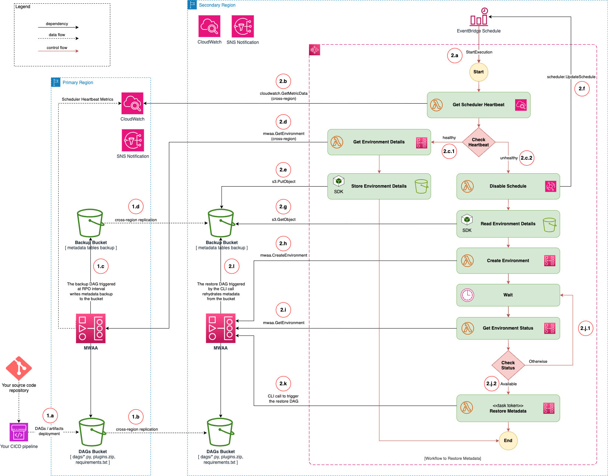

<!-- TOC ignore:true -->
# MWAA Disaster Recovery


[](https://github.com/psf/black)
[](https://htmlpreview.github.io/?https://github.com/aws-samples/mwaa-disaster-recovery/blob/python-coverage-comment-action-data/htmlcov/index.html)
[](https://badge.fury.io/py/mwaa-dr)

<!-- TOC ignore:true -->
# Contents
<!-- TOC -->

- [Introduction](#introduction)
- [Architecture](#architecture)
    - [Backup and Restore](#backup-and-restore)
        - [BR Flow 1: Periodic Backup](#br-flow-1-periodic-backup)
        - [BR Flow 2: Recovery](#br-flow-2-recovery)
    - [Warm Standby](#warm-standby)
        - [WS Flow 1: Periodic Backup](#ws-flow-1-periodic-backup)
        - [WS Flow 2: Recovery](#ws-flow-2-recovery)
- [Solution](#solution)
    - [Prerequisites](#prerequisites)
        - [Software Requirements](#software-requirements)
        - [AWS Resources Needed Pre-Deployment](#aws-resources-needed-pre-deployment)
    - [Stack Parameters](#stack-parameters)
        - [Required Parameters](#required-parameters)
        - [Optional Parameters](#optional-parameters)
        - [Automated Updates to the Execution Role](#automated-updates-to-the-execution-role)
        - [Automated Update to the VPC Security Group](#automated-update-to-the-vpc-security-group)
- [Step-By-Step Deployment Guide](#step-by-step-deployment-guide)
    - [Backup and Restore Tutorial](#backup-and-restore-tutorial)
        - [BR-1: Create Necessary AWS Resources](#br-1-create-necessary-aws-resources)
        - [BR-2: Setup Local Virtual Environment](#br-2-setup-local-virtual-environment)
        - [BR-3: Setup Environment Variables](#br-3-setup-environment-variables)
        - [BR-4: Build the Project](#br-4-build-the-project)
        - [BR-5: Deploy the Solution](#br-5-deploy-the-solution)
        - [BR-6: Explore the Airflow UI](#br-6-explore-the-airflow-ui)
        - [BR-7: Manual Backup](#br-7-manual-backup)
        - [BR-8: Simulate DR for Testing](#br-8-simulate-dr-for-testing)
        - [BR-9: Monitor the DR StepFunctions Workflow](#br-9-monitor-the-dr-stepfunctions-workflow)
    - [Warm Standby Tutorial](#warm-standby-tutorial)
        - [WS-1: Create Necessary AWS Resources](#ws-1-create-necessary-aws-resources)
        - [WS-2: Setup Local Virtual Environment](#ws-2-setup-local-virtual-environment)
        - [WS-3: Setup Environment Variables](#ws-3-setup-environment-variables)
        - [WS-4: Build the Project](#ws-4-build-the-project)
        - [WS-5: Deploy the Solution](#ws-5-deploy-the-solution)
        - [WS-6: Explore the Airflow UI](#ws-6-explore-the-airflow-ui)
        - [WS-7: Manual Backup](#ws-7-manual-backup)
        - [WS-8: Simulate DR for Testing](#ws-8-simulate-dr-for-testing)
        - [WS-9: Monitor the DR StepFunctions Workflow](#ws-9-monitor-the-dr-stepfunctions-workflow)
    - [Clean Up](#clean-up)
    - [Limitations and Special Cases](#limitations-and-special-cases)
        - [Data Loss Probability](#data-loss-probability)
        - [Special Handling of Variable and Connection Tables](#special-handling-of-variable-and-connection-tables)
        - [Clean Metadata Tables Required for the Restore Workflow](#clean-metadata-tables-required-for-the-restore-workflow)
        - [Manually Triggering the Recovery Workflow](#manually-triggering-the-recovery-workflow)
        - [Using the Metadata Backup and Restore DAGs Independently](#using-the-metadata-backup-and-restore-dags-independently)
        - [May Need to Restart Environment for Plugins to Work](#may-need-to-restart-environment-for-plugins-to-work)
- [Frequently Asked Questions](#frequently-asked-questions)
    - [FAQ-1: Failure to Read Environment Backup](#faq-1-failure-to-read-environment-backup)
    - [FAQ-2: Failure to Create New Environment](#faq-2-failure-to-create-new-environment)
- [Development Notes](#development-notes)

<!-- /TOC -->

# Introduction

Amazon Managed Workflow for Apache Airflow ([MWAA](https://aws.amazon.com/managed-workflows-for-apache-airflow/)) is a managed orchestration service for [Apache Airflow](https://airflow.apache.org/). An MWAA deployment comes with meaningful defaults such as multiple availability zone (AZ) deployment of Airflow schedulers and auto-scaling of Airflow workers across multiple AZs, all of which can help customers minimize the impact of an AZ failure. However, a regional large scale event (LSE) can still adversely affect business continuity of critical workflows running on an MWAA environment. To minimize the impact of LSEs, a multi-region architecture is needed that automatically detects service disruption in the primary region and automates cut-over to the secondary region. This project offers an automated-solution for two key [disaster recovery](https://docs.aws.amazon.com/whitepapers/latest/disaster-recovery-workloads-on-aws/disaster-recovery-options-in-the-cloud.html) strategies for MWAA: **Backup Restore** and **Warm Standby**. Let's review the solution architectures and dive-deep into the two strategies next.

This solution is a part of an AWS blog series on MWAA Disaster Recovery. Please review both [Part 1](https://aws.amazon.com/blogs/big-data/disaster-recovery-strategies-for-amazon-mwaa-part-1/) and
[Part 2](https://aws.amazon.com/blogs/big-data/disaster-recovery-strategies-for-amazon-mwaa-part-2/) blog series before diving into the details of the solution.

> [!NOTE]
> The project currently supports the following versions of MWAA:
> - **2.8.1**
> - **2.7.2**
> - **2.6.3**
> - **2.5.1**

# Architecture

In this section, we will discuss two highly resilient, multi-region deployment architectures for MWAA. These architectures can achieve recovery time and recover point objectives of minutes ([Warm Standby](#warm-standby)) to an hour ([Backup and Restore](#backup-and-restore)) based on volume of historical data to be backed up and restored. Let's discuss the the two strategies in details next.

## Backup and Restore

The general idea behind the backup and restore approach is to have the MWAA environment running in the primary region periodically backup its metadata to an S3 bucket in that region, sync the metadata to the secondary region's S3 bucket, and eventually use the backed up metadata to recreate an identical environment in the secondary region when the primary region fails. This approach can afford an RTO of 30+ minutes depending on the size of metadata to be restored. We assume that you have a running MWAA environment with the associated S3 bucket for hosting DAGs to start with. There are two key workflows to consider in this architecture as shown in the diagram below:




### BR Flow 1: Periodic Backup

In order to recreate a new environment in secondary region when the primary environment fails, you have to maintain a backup of the primary metadata store. Flow 1 involves an Airflow DAG to take backup of the metadata tables and store them on S3 bucket to restore the MWAA state in secondary region when needed.

- \[**1.a**] Assuming you host your DAGs code in a source code repository, your CICD pipeline deploys the code changes to the S3 bucket configured to host DAGs, plugins, and the requirements file.

- \[**1.b**] For this architecture, we also assume that you have another S3 bucket deployed to the secondary region to host DAGs, plugins, and the requirements file with bucket versioning enabled. As a part of the CDK deployment of this project, we enable [cross-region replication](https://docs.aws.amazon.com/AmazonS3/latest/userguide/replication.html) from primary to the secondary region buckets. Any new changes to the primary DAGs bucket are replicated in the secondary region. However, for existing objects, a one-time replication will need to be performed using [S3 Batch replication](https://docs.aws.amazon.com/AmazonS3/latest/userguide/s3-batch-replication-batch.html) to the secondary region bucket.

- \[**1.c**] The CDK deployment of the [primary stack](lib/stacks/mwaa_primary_stack.py) deploys the [mwaa_dr](assets/dags/mwaa_dr/) framework package to the primary DAGs S3 bucket. This framework includes the ([backup_metadata](assets/dags/mwaa_dr/backup_metadata.py)) DAG, which periodically takes backup of the metadata store. The backup interval is configurable and should be based on the recovery point objective (RPO) -- the data loss time during a failure that can be sustained by the business.

- \[**1.d**] The CDK deployment of the [primary stack](lib/stacks/mwaa_primary_stack.py) also creates a backup S3 bucket to store metadata tables backup. The [secondary stack](lib/stacks/mwaa_secondary_stack.py) creates another S3 backup bucket in the secondary region. Similar to the DAGs S3 bucket, the backup bucket is also replicated to the corresponding secondary region bucket using S3 cross-region replication ensuring the backup of the Amazon MWAA metadata is available in the secondary region.

### BR Flow 2: Recovery

The [BR Flow 1](#br-flow-1-periodic-backup) helps with backing up the state of the primary MWAA environment. The Flow 2 detects a failure in the primary environment and triggers the recovery of the MWAA environment in the secondary region. The recover involves creating a new MWAA environment from the stored configuration of the primary environment (as a part of Flow 2) and eventually rehydrating the new environment with the metadata backed up from the primary environment (Flow 1).

- \[**2.a**] The [secondary CDK stack](lib/stacks/mwaa_secondary_stack.py) deploys a StepFunctions workflow in the secondary region which is periodically executed based on the supplied EventBridge schedule. The scheduled interval should be based on the RTO that you want, i.e., `RTO >= EventBridgeScheduleInterval + EnvironmentCreationTime + MetadataRestoreTime`.

- \[**2.b**] The workflow, using an [AWS Lambda](https://aws.amazon.com/pm/lambda/) function, retrieves the [SchedulerHeartBeat](https://docs.aws.amazon.com/mwaa/latest/userguide/access-metrics-cw-202.html#available-metrics-cw-v202) CloudWatch metrics from the primary MWAA environment.

- \[**2.c.1**] When the heartbeat signals from the primary MWAA environment are detected in the metrics, the workflow moves on to storing the environment configuration subflow as follows:

    - \[**2.d**] The workflow makes [GetEnvironment](https://docs.aws.amazon.com/mwaa/latest/API/API_GetEnvironment.html) API call through a Lambda function. The API returns the status among other configuration details of the MWAA environment.

    - \[**2.e**] The workflow stores the environment configuration in the backup bucket to be later used during recovery for creating a new MWAA environment in the secondary region (step 2.h) and ends.

- \[**2.c.2**] When the heartbeat signals from the primary MWAA environment are not detected in the metrics, the workflow moves on to the recovery subflow as follows (note that it can take up to 5 minutes to detect an environment failure):

    - \[**2.f**] As a first step of the recovery subflow, the EventBridge schedule is disabled to prevent subsequent duplicate recovery flow.

    - \[**2.g**] The environment configuration stored to backup bucket during the previous successful heartbeat (step 2.e) is read to recreate a new MWAA environment.

    - \[**2.h**] The workflow then uses a Lambda function to create a new MWAA environment using the [CreateEnvironment](https://docs.aws.amazon.com/mwaa/latest/API/API_CreateEnvironment.html) API and waits for the supplied polling interval. The API call uses the environment configuration from the backup bucket with some changes to incorporate the settings of the secondary region such as the different S3 DAGs bucket, VPC, subnets, and security groups that are supplied as secondary stack [configuration](#stack-parameters).

    - \[**2.i**] Using [GetEnvironment](https://docs.aws.amazon.com/mwaa/latest/API/API_GetEnvironment.html) API call in an AWS Lambda function, the workflow gets the status of the environment creation.

    - \[**2.j.1**] Until the status of the newly created MWAA environment becomes available, the workflow waits for a supplied duration and keeps polling the status in a loop.

    - \[**2.j.2**] When the MWAA environment becomes available the workflow comes out of the polling loop.

    - \[**2.k**] The workflow then restores the metadata from the S3 backup bucket into the newly created environment by triggering the [restore_metadata](assets/dags/mwaa_dr/restore_metadata.py) DAG. It uses the [task token integration](https://docs.aws.amazon.com/step-functions/latest/dg/connect-to-resource.html#connect-wait-token), in which, it waits for the restore DAG to respond back with success or failure notification before completing the workflow.

    - \[**2.l**] The DAG for restoring metadata hydrates the newly created MWAA environment with the metadata stored in the backup bucket and finally, returns a success token back to the StepFunctions workflow, which successfully ends the flow.


## Warm Standby

In the warm standby approach, we start with two identical MWAA environments, one in the primary and the other in the secondary region. The metadata in the primary region is backed up in an S3 bucket with cross-region replication to a secondary region bucket. In case of the primary MWAA environment failure, the backed up metadata is restored in the secondary MWAA to restart the DAG workflows in the secondary region. Since the MWAA environment is already created/warm in the secondary region, this approach can achieve recovery time objective of 5+ minutes depending on the amount of metadata to be restored. There are two key workflows in this architecture as shown in the diagram below:


### WS Flow 1: Periodic Backup

In order to restore the primary MWAA environment in the secondary region, you have to maintain a backup of the primary metadata store. Flow 1 involves an Airflow DAG to take backup of the metadata tables and store them in an S3 bucket.

- \[**1.a**] Assuming you host your DAGs code in a source code repository, your CICD pipeline deploys the code changes to the S3 bucket configured to host DAGs, plugins, and the requirements file.

- \[**1.b**] For this architecture, we also assume that you have another S3 bucket deployed to the secondary region to host DAGs, plugins, and the requirements file with bucket versioning enabled. As a part of the CDK deployment of this project, we enable [cross-region replication](https://docs.aws.amazon.com/AmazonS3/latest/userguide/replication.html) from primary to the secondary region buckets. Any new changes to the primary DAGs bucket are replicated in the secondary region. However, for existing objects, a one-time replication will need to be performed using [S3 Batch replication](https://docs.aws.amazon.com/AmazonS3/latest/userguide/s3-batch-replication-batch.html) to the secondary region bucket.

- \[**1.c**] The CDK deployment of the [primary stack](lib/stacks/mwaa_primary_stack.py) deploys the [mwaa_dr](assets/dags/mwaa_dr/) framework package to the primary DAGs S3 bucket. This framework includes the ([backup_metadata](assets/dags/mwaa_dr/backup_metadata.py)) DAG, which periodically takes backup of the metadata store. The backup interval is configurable and should be based on the recovery point objective (RPO) -- the data loss time during a failure that can be sustained by the business.

- \[**1.d**] The CDK deployment of the [primary stack](lib/stacks/mwaa_primary_stack.py) also creates a backup S3 bucket to store metadata tables backup. The [secondary stack](lib/stacks/mwaa_secondary_stack.py) creates another S3 backup bucket in the secondary region. Similar to the DAGs S3 bucket, the backup bucket is also replicated to the corresponding secondary region bucket using S3 cross-region replication ensuring the backup of the Amazon MWAA metadata is available in the secondary region.

### WS Flow 2: Recovery

As discussed in the previous sections, [WS Flow 1](#ws-flow-1-periodic-backup) helps backup the metadata of the primary MWAA environment. Flow 2, on the other hand, detects a failure in the primary environment and triggers the recovery of the MWAA environment in the secondary region. The recover involves rehydrating the standby secondary environment with the metadata backed up from the primary environment.

- \[**2.a**] The [secondary CDK stack](lib/stacks/mwaa_secondary_stack.py) deploys a StepFunctions workflow in the secondary region which is periodically executed based on the supplied EventBridge schedule. The scheduled interval should be based on the RTO that you want, i.e., `RTO >= EventBridgeScheduleInterval + MetadataRestoreTime`.

- \[**2.b**] The workflow, using an [AWS Lambda](https://aws.amazon.com/pm/lambda/) function, retrieves the [SchedulerHeartBeat](https://docs.aws.amazon.com/mwaa/latest/userguide/access-metrics-cw-202.html#available-metrics-cw-v202) CloudWatch metrics from the primary MWAA environment.

- \[**2.c.1**] When the heartbeat signals from the primary MWAA environment are detected in the metrics, the workflow ends as no further actions are needed.

- \[**2.c.2**] When the heartbeat signals from the primary MWAA environment are not detected in the metrics, the workflow executes a recovery subflow as follows:

    - \[**2.d**] As a first step of the recovery subflow, the EventBridge schedule is disabled to prevent subsequent duplicate recovery flow.

    - \[**2.e**] The workflow then restores the metadata from the S3 backup bucket into the standby secondary environment by triggering the [restore_metadata](assets/dags/mwaa_dr/restore_metadata.py) DAG. It uses the [task token integration](https://docs.aws.amazon.com/step-functions/latest/dg/connect-to-resource.html#connect-wait-token), in which, it waits for the restore DAG to respond back with success or failure notification before completing the workflow.

    - \[**2.f**] The DAG for restoring metadata hydrates the standby MWAA environment with the metadata stored in the backup bucket and finally, returns a success token back to the StepFunctions workflow, which ends the flow successfully.


# Solution

The [lib](lib) folder hosts the deployment code for the project. The project performs multi-region deployment of two stacks:
- [The Primary Region Stack](lib/stacks/mwaa_primary_stack.py)
    - Deploys a backup S3 bucket to the primary region
    - Sets up cross region replications for both MWAA DAGs and backup S3 buckets
    - Deploys the [mwaa_dr](assets/dags/mwaa_dr/) framework to the DAGs S3 bucket, which include DAGs for [backup](assets/dags/mwaa_dr/backup_metadata.py), [restore](assets/dags/mwaa_dr/restore_metadata.py), and [cleanup](assets/dags/mwaa_dr/cleanup_metadata.py) of metadata store
    - Deploys the [Airflow CLI](lib/constructs/airflow_cli.py) custom resource and associated lambda functions to setup necessary Airflow variables on the primary MWAA environment
    - Deploys an SNS topic for DAG failure notification

- [The Secondary Region Stack](lib/stacks/mwaa_secondary_stack.py)
    - Deploys a backup S3 bucket to the secondary region
    - Deploys a StepFunctions workflow and associated Lambda functions to the secondary region configured with EventBridge schedule for health check of the primary region MWAA environment
    - Deploys an SNS topic for workflow failure notification

## Prerequisites

### Software Requirements
[](https://www.python.org/downloads/)
[](https://nodejs.org/en/download)
[](https://docs.aws.amazon.com/cdk/v2/guide/cli.html)
[](https://docs.docker.com/get-docker/)


### AWS Resources Needed Pre-Deployment
- An AWS account with an MWAA environment deployed to the **primary** region. If you don't have an environment deployed, you can do so using the [quickstart guide](https://docs.aws.amazon.com/mwaa/latest/userguide/quick-start.html).

- For [Warm Standby](#warm-standby), another identical MWAA environment deployed to the **secondary** region. Note that [Backup and Restore](#backup-and-restore) does not require a running MWAA environment in the secondary region.

- DAGs S3 buckets with versioning enabled in both primary and secondary region. Copy the packages in [assets/requirements.txt](assets/requirements.txt) to requirements files in the DAGs S3 buckets if already available or upload the provided requirements file to the buckets and [configure the MWAA environments](https://docs.aws.amazon.com/mwaa/latest/userguide/working-dags-dependencies.html) to use the requirements files.

- The solution enables cross region replication for the DAGs buckets, so any new files/changes are replicated from the primary to the secondary bucket. However, the solution does not copy any pre-existing objects. You can manually upload your existing DAGs and plugin files to the secondary region DAGs bucket as an initial setup.

- The security groups used by MWAA environment. In the secondary region, this can be the default security group of the VPC if not already defined, i.e., in the case of [backup and restore](#backup-and-restore). You can find the VPC, security groups, and subnet information of an existing MWAA environment on your AWS console.

- An MWAA execution role each in both regions with the permission you need for your DAGs. At a minimum, please include the following permission policies (replace `<region>`, `<account>`, `<mwaa-env-name>`, and `<dags-s3-bucket-name>` with appropriate values):
```json
{
    "Version": "2012-10-17",
    "Statement": [
        {
            "Effect": "Allow",
            "Action": "airflow:PublishMetrics",
            "Resource": "arn:aws:airflow:<region>:<account>:environment/<mwaa-env-name>"
        },
        {
            "Effect": "Allow",
            "Action": [
                "s3:GetObject*",
                "s3:GetBucket*",
                "s3:List*"
            ],
            "Resource": [
                "arn:aws:s3:::<dags-s3-bucket-name>",
                "arn:aws:s3:::<dags-s3-bucket-name>/*"
            ]
        },
        {
            "Effect": "Allow",
            "Action": [
                "logs:CreateLogStream",
                "logs:CreateLogGroup",
                "logs:PutLogEvents",
                "logs:GetLogEvents",
                "logs:GetLogRecord",
                "logs:GetLogGroupFields",
                "logs:GetQueryResults"
            ],
            "Resource": [
                "arn:aws:logs:<region>:<account>:log-group:airflow-*"
            ]
        },
        {
            "Effect": "Allow",
            "Action": [
                "logs:DescribeLogGroups",
                "cloudwatch:PutMetricData"
            ],
            "Resource": [
                "*"
            ]
        },
        {
            "Effect": "Allow",
            "Action": [
                "sqs:ChangeMessageVisibility",
                "sqs:DeleteMessage",
                "sqs:GetQueueAttributes",
                "sqs:GetQueueUrl",
                "sqs:ReceiveMessage",
                "sqs:SendMessage"
            ],
            "Resource": "arn:aws:sqs:<region>:*:airflow-celery-*"
        },
        {
            "Effect": "Allow",
            "Action": [
                "kms:Decrypt",
                "kms:DescribeKey",
                "kms:GenerateDataKey*",
                "kms:Encrypt"
            ],
            "NotResource": "arn:aws:kms:*:<account>:key/*",
            "Condition": {
                "StringLike": {
                    "kms:ViaService": [
                        "sqs.<region>.amazonaws.com"
                    ]
                }
            }
        }
    ]
}
```

Also add the following trust policy to the role:
```json
{
    "Version": "2012-10-17",
    "Statement": [
        {
            "Effect": "Allow",
            "Principal": {
                "Service": [
                    "airflow.amazonaws.com",
                    "airflow-env.amazonaws.com"
                ]
            },
            "Action": "sts:AssumeRole"
        }
    ]
}
```

## Stack Parameters

The parameters for the solution are externalized as environment variables. You can specify these parameters as environment variables in your CICD pipeline or create a `.env` file with appropriate key and values at the root of this project for a deployment from your machine. You can find more details in the implementation sections [BR-3: Setup Environment Variables](#br-3-setup-environment-variables) and  [WS-3: Setup Environment Variables](#ws-3-setup-environment-variables). Let's review the required parameters first followed by the optional ones.

### Required Parameters

Here are the required parameters that applies to both primary and secondary region stacks:

| Variable Name | Example Values | Description |
| ------------- | -------------- | ----------- |
| `AWS_ACCOUNT_ID` | `111222333444` | Your AWS account id. |
| `DR_TYPE` | `BACKUP_RESTORE`, `WARM_STANDBY` | The disaster recovery strategy to be deployed. |
| `MWAA_UPDATE_EXECUTION_ROLE` | `YES` or `NO` | Flag to denote whether to update the existing MWAA execution role with new policies for allowing task token return calls from the StepFunctions workflow in the secondary stack. See the [Automated Updates to the Execution Role](#automated-updates-to-the-execution-role) for details. |
| `MWAA_VERSION` | `2.5.1`, `2.6.3`, `2.7.2` | The deployed version of MWAA. |
| `PRIMARY_DAGS_BUCKET_NAME` | `mwaa-2-5-1-primary-bucket` | The name of the DAGs S3 bucket used by the environment in the primary region. |
| `PRIMARY_MWAA_ENVIRONMENT_NAME` | `mwaa-2-5-1-primary` | The name of the MWAA environment in the primary region. |
| `PRIMARY_MWAA_ROLE_ARN` | `arn:aws:...:role/service-role/primary-role` | The ARN of the execution role used by the primary MWAA environment. |
| `PRIMARY_REGION` | `us-east-1`, `us-east-2`, ... | The primary AWS region. |
| `PRIMARY_SECURITY_GROUP_IDS` | `'["sg-0123456789"]'` | The IDs of the security groups used by the primary MWAA environment. Note that the brackets, `[]`, are necessary to denote a list even for a single element list. |
| `PRIMARY_SUBNET_IDS` | `'["subnet-1234567", "subnet-987654321"]'` | The ID of the VPC subnets where the primary MWAA environment is deployed. Note that the brackets, `[]`, are necessary to denote a list even for a single element list. |
| `PRIMARY_VPC_ID` | `vpc-012ab34c56d789101` | The ID of the VPC where the primary MWAA environment is deployed. |
| `SECONDARY_CREATE_SFN_VPCE` | `YES` or `NO` | Flag to denote whether to create a VPC endpoint for Step Functions. The VPCE is particularly important for MWAA running in private mode, where workers may not have internet access to send task token response to the Step Functions orchestrating the restore workflow. If `NO` is chosen, then you will need to manually create the VPC endpoint. Enabling this flag may modify your VPC's security group. See the [Automated Update to the VPC Security Group](#automated-update-to-the-vpc-security-group) for details. |
| `SECONDARY_DAGS_BUCKET_NAME` | `mwaa-2-5-1-secondary-bucket` | The name of the S3 DAGs bucket used by the environment in the secondary region. |
| `SECONDARY_MWAA_ENVIRONMENT_NAME` | `mwaa-2-5-1-secondary` | The name of the MWAA environment in the secondary region. |
| `SECONDARY_MWAA_ROLE_ARN` | `arn:aws:...:role/service-role/secondary-role` | The ARN of the execution role used by the secondary MWAA environment. |
| `SECONDARY_REGION` | `us-west-1`, `us-west-2`, ... | The secondary AWS region for diaster recovery. |
| `SECONDARY_SECURITY_GROUP_IDS` | `'["sg-0123456789"]'` | The IDs of the security groups used by the secondary MWAA environment. Note that the brackets, `[]`, are necessary to denote a list even for a single element list. |
| `SECONDARY_SUBNET_IDS` | `'["subnet-1234567", "subnet-987654321"]'` | The ID of the VPC subnets in the secondary region where the MWAA environment is deployed. Note that the brackets, `[]`, are necessary to denote a list even for a single element list. |
| `SECONDARY_VPC_ID` | `vpc-012ab34c56d789101` | The ID of the VPC where the secondary MWAA environment is deployed. |
| `STACK_NAME_PREFIX` | `mwaa-2-5-1-data-team` | A name prefix for the deployment stacks. This prefix will be used for primary and secondary stacks as well as their resources. |

### Optional Parameters

Here are the optional parameters that applies to both primary and secondary region stacks:

| Variable Name | Default Value | Example Values | Description |
| ------------- | ------------- | -------------- | ----------- |
| `HEALTH_CHECK_ENABLED` | `YES` | `YES` or `NO` | Whether to enable periodic health check of the primary MWAA environment from the secondary region. If set to `NO` the, primary region failure will go undetected and the onus is on admins to manually trigger the recovery workflow. |
| `HEALTH_CHECK_INTERVAL_MINS` | `5` | time interval in minutes | Health check frequency of the primary mwaa environment in mins. |
| `HEALTH_CHECK_MAX_RETRY` | `2` | number | The maximum number of retries after the health check of the primary region MWAA fails before moving on to the disaster recovery flow. |
| `HEALTH_CHECK_RETRY_BACKOFF_RATE` | `2` | number | Health check retry exponential backoff rate (exponential backoff common ratio). |
| `HEALTH_CHECK_RETRY_INTERVAL_SECS` | `5` | time interval in seconds | Health check retry interval (exponential backoff coefficient) on failure. |
| `METADATA_EXPORT_DAG_NAME` | [backup_metadata](assets/dags/mwaa_dr/backup_metadata.py) | a dag name | Name of the DAG that exports metadata. |
| `METADATA_IMPORT_DAG_NAME` | [restore_metadata](assets/dags/mwaa_dr/restore_metadata.py) | a dag name | Name of the DAG that imports metadata. |
| `MWAA_BACKUP_FILE_NAME` | `environment.json` | a json file name | Name of the file (json) to used for storing environment details in the backup S3 bucket. |
| `MWAA_CREATE_ENV_POLLING_INTERVAL_SECS` | `60` | interval in seconds | Wait time before checking status of the MWAA environment in the polling loop during creation. |
| `MWAA_DAGS_S3_PATH` | `dags` | `path/to/dags` | Path to the folder in the DAGs S3 bucket where DAGs are deployed. |
| `MWAA_NOTIFICATION_EMAILS` | `[]` | `'["ad@eg.com"]'`, `'["ad@eg.com", "ops@eg.com"]'` | Comma separated list of emails. Note that the brackets, `[]`, are necessary to denote a list even for a single element list. |
| `MWAA_SIMULATE_DR` | `NO` | `YES` or `NO` | Whether to simulate a DR by artificially forcing health check failure for the MWAA environment in the primary region. Only use for testing. |
| `PRIMARY_BACKUP_SCHEDULE` | `'0 * * * *'` | `@hourly`, `@daily`, or any cron expressions | Cron schedule for taking backup of the metadata store. |
| `STATE_MACHINE_TIMEOUT_MINS` | `60` | timeout in minutes | The restore Step Fuctions workflow timeout in minutes. |

### Automated Updates to the Execution Role

Note that the [secondary region stack](lib/stacks/mwaa_secondary_stack.py) will add an additional policy statement to the MWAA execution role for the secondary region if the configuration parameter `MWAA_UPDATE_EXECUTION_ROLE` is set to `YES`. If you intend to set this parameter to `NO`, then please add the following policy entry to secondary MWAA execution role:

```json
{
    "Effect": "Allow",
    "Action": [
        "states:SendTaskFailure",
        "states:SendTaskHeartbeat",
        "states:SendTaskSuccess"
    ],
    "Resource": ["arn:aws:states:*:<account>:stateMachine:*"]
}
```

### Automated Update to the VPC Security Group

Note that if you supplied a VPC security group for your MWAA environment and if the security group does not allow inbound HTTPS traffic (port 443) originating from within the VPC CIDR range, then the stack will add a new rule to the security group to do so. The HTTPS traffic is required for the use of StepFunctions interface endpoint that make the StepFunctions accessible to your private network through [AWS PrivateLink](https://docs.aws.amazon.com/vpc/latest/privatelink/what-is-privatelink.html).


# Step-By-Step Deployment Guide

The project uses Cloud Development Kit (CDK) and is set up like a standard Python project. Assuming that you have AWS credentials for deploying the project setup for your command shell, follow these steps to build and deploy the solution to your AWS account.

First, let's clone the project in your local machine:
```sh
git clone https://github.com/aws-samples/mwaa-disaster-recovery.git
cd mwaa-disaster-recovery
```

This deployment guide walks through first deploying the stack in [backup and restore](#backup-and-restore) mode followed by [warm standby](#warm-standby).

## Backup and Restore Tutorial

### BR-1: Create Necessary AWS Resources

If you already don't have an MWAA environment, use the [quickstart guide](https://docs.aws.amazon.com/mwaa/latest/userguide/quick-start.html) or follow these steps to create a new MWAA environment:

1. Create a S3 bucket with versioning enabled on AWS console in your primary region, let's call it `mwaa-2-5-1-primary-source` (you will probably need to specify a different name as S3 bucket name must be globally unique).
2. Assuming you will name your primary mwaa environment `mwaa-2-5-1-primary`, create an IAM role as documented in the [AWS Resources](#aws-resources) pre-requisites section.
3. Create an MWAA environment on AWS console and using S3 bucket and execution role that you created in steps 1 and 2. Choose default VPC, subnets, and security group.
4. Similarly create another S3 bucket and IAM role in your secondary region.


### BR-2: Setup Local Virtual Environment

You will need a virtualenv created within the project, which is stored under the `.venv` directory.  To create the virtualenv, it assumes that there is a `python3` executable in your path with access to the `venv` package. Create your virtualenv as follows:

```sh
python3 -m venv .venv
```

Next, you will need to activate your virtual environment.

MacOS / Linux:
```sh
source .venv/bin/activate
```

Windows:
```sh
.venv\Scripts\activate.bat
```

Once the virtualenv is activated, you can install the required dependencies:
```sh
pip install -r requirements.txt
pip install -r requirements-dev.txt
```

### BR-3: Setup Environment Variables

Create a `.env` file at the root of the project by copying the following contents and making appropriate changes. The configuration parameters are explained in the [stack parameters](#stack-parameters) section.

```sh
STACK_NAME_PREFIX=mwaa-2-5-1
AWS_ACCOUNT_ID=123456789101
DR_TYPE=BACKUP_RESTORE

MWAA_VERSION=2.5.1
MWAA_UPDATE_EXECUTION_ROLE=YES

PRIMARY_REGION=us-east-1
PRIMARY_MWAA_ENVIRONMENT_NAME=mwaa-2-5-1-primary
PRIMARY_MWAA_ROLE_ARN=arn:aws:iam::123456789101:role/service-role/mwaa-2-5-1-primary-role
PRIMARY_DAGS_BUCKET_NAME=mwaa-2-5-1-primary-source
PRIMARY_VPC_ID=vpc-012ab34c56d789101
PRIMARY_SUBNET_IDS='["subnet-1234567", "subnet-987654321"]'
PRIMARY_SECURITY_GROUP_IDS='["sg-0123456789"]'

SECONDARY_REGION=us-east-2
SECONDARY_MWAA_ENVIRONMENT_NAME=mwaa-2-5-1-secondary
SECONDARY_MWAA_ROLE_ARN=arn:aws:iam::123456789101:role/service-role/mwaa-2-5-1-secondary-role
SECONDARY_DAGS_BUCKET_NAME=mwaa-2-5-1-secondary-source
SECONDARY_VPC_ID=vpc-1111222233334444
SECONDARY_SUBNET_IDS='["subnet-2222222", "subnet-3333333"]'
SECONDARY_SECURITY_GROUP_IDS='["sg-111222333444"]'
SECONDARY_CREATE_SFN_VPCE=YES
```

### BR-4: Build the Project

At this point you can now synthesize the CloudFormation template for this code:
```sh
cdk synth
```

You can also see what stacks and resources get created by typing:
```sh
cdk diff
```

### BR-5: Deploy the Solution

Now you are ready to deploy the stacks, the following deploys both primary and the secondary region stacks:
```sh
cdk deploy --all
```

### BR-6: Explore the Airflow UI

From MWAA console, explore the Airflow UI, it should have the following DAGs available:
- [backup_metadata](assets/dags/mwaa_dr/backup_metadata.py) - this backs up metadata based on the provided schedule and should be **enabled**
- [cleanup_metadata](assets/dags/mwaa_dr/cleanup_metadata.py) - this DAG provided as a part of the [mwaa_dr](assets/dags/mwaa_dr/) framework will cleanup the metadata store for restore to work without database constraint violations. This is a utility DAG and can used as needed during restore process and should be in **disabled** state
- [restore_metadata](assets/dags/mwaa_dr/restore_metadata.py) - this DAG will restore metadata from S3 backup and should be in **disabled** state

Feel free to upload additional dags and play around to generate some metadata for the backup restore process. Here is a [sample dag](https://airflow.apache.org/docs/apache-airflow/2.5.1/tutorial/fundamentals.html) that you can upload in the `dags` folder of your DAGs S3 bucket.

### BR-7: Manual Backup

While the backups are taken automatically based on the supplied schedule, you can manually trigger the `backup_metadata` DAG to force generate backup in the corresponding backup (not DAGs) S3 bucket. Explore the `data` folder in the backup S3 bucket to review the CSV dump generated by the backup DAG. The stack automatically replicates both DAGs and backup S3 buckets to the secondary region.

### BR-8: Simulate DR for Testing

To be able to perform DR testing, you will need to have the **existing** `requirements.txt` file, plugins, and DAGs replicated from the primary to the secondary DAGs S3 bucket (note that any new changes are replicated automatically, existing objects are not).  If the version of `requirements.txt` used by your primary MWAA environment from the primary DAGs S3 bucket is not available in the secondary DAGs S3 bucket, then you will encounter an error detailed in the [FAQ-2 Failure to Create New Environment](#faq-2-failure-to-create-new-environment) section.

To avoid this issue, use a S3 Batch Replication job to perform a one time replication of the existing objects including `requirements.txt` from the primary DAGs S3 bucket to the secondary. Please follow [step 4 (only) of this tutorial](https://aws.amazon.com/getting-started/hands-on/replicate-existing-objects-with-amazon-s3-batch-replication/?ref=docs_gateway/amazons3/s3-batch-replication-batch.html). After the replication is complete, you can simulate a DR situation by setting the `MWAA_SIMULATE_DR` parameter in your `.env` file as follows:
```sh
MWAA_SIMULATE_DR=YES

STACK_NAME_PREFIX=mwaa-2-5-1
AWS_ACCOUNT_ID=123456789101
...
```

Now re-deploy the project:
```sh
cdk deploy --all
```

### BR-9: Monitor the DR StepFunctions Workflow

On AWS console, monitor the StepFunction deployed as a part of the secondary region stack, which will orchestrate creating a new environment in the secondary region and eventually restoring the backup data to the newly created environment.

The Airflow UI should show past DAG runs as well as logs, variables, and connections restored from the primary MWAA environment. All the active DAGs in the primary region should also be active in the secondary region.


## Warm Standby Tutorial

### WS-1: Create Necessary AWS Resources

The Warm Standby approach will need an MWAA environment each in two AWS regions. If you already don't have MWAA environments, use the [quickstart guide](https://docs.aws.amazon.com/mwaa/latest/userguide/quick-start.html) or follow these steps to create a new MWAA environment each in the **two AWS regions**:

1. Create a S3 bucket with versioning enabled on AWS console in your primary region, let's call it `mwaa-2-5-1-primary-source` (you will probably need to specify a different name as S3 bucket name must be globally unique). Similarly, create another bucket with versioning enabled in the secondary region, let's call it `mwaa-2-5-1-secondary-source` bucket.
2. Assuming you will name your primary mwaa environment `mwaa-2-5-1-primary`, create an IAM role as documented in the [AWS Resources](#aws-resources) pre-requisites section. You will need two roles, one for each MWAA environment in the two regions.
3. Create an MWAA environment on AWS console and using S3 bucket and execution role that you created in steps 1 and 2. Choose default VPC, subnets, and security group in the primary region. Similarly, you will need to create another environment in the secondary MWAA region.


### WS-2: Setup Local Virtual Environment

You will need a virtualenv created within the project, which is stored under the `.venv` directory.  To create the virtualenv, it assumes that there is a `python3` executable in your path with access to the `venv` package. Create your virtualenv as follows:

```sh
python3 -m venv .venv
```

Next, you will need to activate your virtual environment.

MacOS / Linux:
```sh
source .venv/bin/activate
```

Windows:
```sh
.venv\Scripts\activate.bat
```

Once the virtualenv is activated, you can install the required dependencies:
```sh
pip install -r requirements.txt
pip install -r requirements-dev.txt
```

### WS-3: Setup Environment Variables

Create a `.env` file at the root of the project by copying the following contents and making appropriate changes. The configuration parameters are explained in the [stack parameters](#stack-parameters) section.

```sh
STACK_NAME_PREFIX=mwaa-2-5-1
AWS_ACCOUNT_ID=123456789101
DR_TYPE=WARM_STANDBY

MWAA_VERSION=2.5.1
MWAA_UPDATE_EXECUTION_ROLE=YES

PRIMARY_REGION=us-east-1
PRIMARY_MWAA_ENVIRONMENT_NAME=mwaa-2-5-1-primary
PRIMARY_MWAA_ROLE_ARN=arn:aws:iam::123456789101:role/service-role/mwaa-2-5-1-primary-role
PRIMARY_DAGS_BUCKET_NAME=mwaa-2-5-1-primary-source
PRIMARY_VPC_ID=vpc-012ab34c56d789101
PRIMARY_SUBNET_IDS='["subnet-1234567", "subnet-987654321"]'
PRIMARY_SECURITY_GROUP_IDS='["sg-0123456789"]'

SECONDARY_REGION=us-east-2
SECONDARY_MWAA_ENVIRONMENT_NAME=mwaa-2-5-1-secondary
SECONDARY_MWAA_ROLE_ARN=arn:aws:iam::123456789101:role/service-role/mwaa-2-5-1-secondary-role
SECONDARY_DAGS_BUCKET_NAME=mwaa-2-5-1-secondary-source
SECONDARY_VPC_ID=vpc-1111222233334444
SECONDARY_SUBNET_IDS='["subnet-2222222", "subnet-3333333"]'
SECONDARY_SECURITY_GROUP_IDS='["sg-111222333444"]'
SECONDARY_CREATE_SFN_VPCE=YES
```

### WS-4: Build the Project

At this point you can now synthesize the CloudFormation template for this code:
```sh
cdk synth
```

You can also see what stacks and resources get created by typing:
```sh
cdk diff
```

### WS-5: Deploy the Solution

Now you are ready to deploy the stacks, the following deploys both primary and the secondary region stacks:
```sh
cdk deploy --all
```

### WS-6: Explore the Airflow UI

From MWAA console, explore the Airflow UI, it should have the following DAGs available:
- [backup_metadata](assets/dags/mwaa_dr/backup_metadata.py) - this backs up metadata based on the provided schedule and should be **enabled**
- [cleanup_metadata](assets/dags/mwaa_dr/cleanup_metadata.py) - this DAG provided as a part of the [mwaa_dr](assets/dags/mwaa_dr/) framework will cleanup the metadata store for restore to work without database constraint violations. This is a utility DAG and can used as needed during DR testing on the existing secondary MWAA environment. The DAG should be in **disabled** state. **NOTE**: it is highly recommended to run this DAG before the warm standby DR testing to avoid restore failure due to database key constraints violations.
- [restore_metadata](assets/dags/mwaa_dr/restore_metadata.py) - this DAG will restore metadata from S3 backup and should be in **disabled** state

Feel free to upload additional dags and play around to generate some metadata for the backup restore process. Here is a [sample dag](https://airflow.apache.org/docs/apache-airflow/2.5.1/tutorial/fundamentals.html) that you can upload in the `dags` folder of your DAGs S3 bucket.

### WS-7: Manual Backup

While the backups are taken automatically based on the supplied schedule, you can manually trigger the `backup_metadata` DAG to force generate backup in the corresponding backup (not DAGs) S3 bucket. Explore the `data` folder in the backup S3 bucket to review the CSV dump generated by the backup DAG. The stack automatically replicates both DAGs and backup S3 buckets to the secondary region.

### WS-8: Simulate DR for Testing

You can simulate a DR situation by setting the `MWAA_SIMULATE_DR` parameter in your `.env` file as follows:
```sh
MWAA_SIMULATE_DR=YES

STACK_NAME_PREFIX=mwaa-2-5-1
AWS_ACCOUNT_ID=123456789101
...
```

Now re-deploy the project:
```sh
cdk deploy --all
```

### WS-9: Monitor the DR StepFunctions Workflow

On AWS console, monitor the StepFunction deployed as a part of the secondary region stack, which will orchestrate restoring the backup data in the existing secondary MWAA environment.

The Airflow UI should show past DAG runs as well as logs, variables, and connections restored from the primary MWAA environment. All the active DAGs in the primary region should also be active in the secondary region.

## Clean Up

You can clean up the resources deployed through this solution by simply deleting the stacks as follows:
```sh
cdk destroy --all
```
> [!CAUTION]
> Destroying the stacks will also delete the backup S3 buckets in both primary and secondary regions. DAGs S3 buckets in both region will remain intact and the [dags/mwaa_dr](./assets/dags/mwaa_dr) folder in both buckets will need to be manually deleted. For the backup restore strategy, environment created as a result of the restore workflow in the secondary region will also need to be manually deleted either on AWS Console or through AWS CLI.

## Limitations and Special Cases
The project offers a custom solution to address the disaster recovery needs for Amazon MWAA. Since it is a non-native solution, there are some important limitations to be aware of as follows:

### Data Loss Probability

The project **only** takes metadata backup of the tasks that are not actively running in the primary environment, i.e, it excludes task instances in any of [`running`, `restarting`, `queued`, `scheduled`, `up_for_retry`, and `up_for_reschedule`] states. Hence, the solution cannot restore an actively running DAG in the secondary environment. If the primary environment fails while actively running some DAGs, then those DAGs will restart at the specified next schedules after cut over to the secondary environment. If those DAGs do not have schedules specified, then the admins will need to manually trigger them in the secondary location.

> [!CAUTION]
> As a side-effect of the aforementioned strategy, the metadata of the most recently run [backup_metadata](assets/dags/mwaa_dr/backup_metadata.py) DAG will be excluded from the backup, as the DAG will be in active state when its taking backup of the metadata.

> [!IMPORTANT]
> Note that, by default, the solution backs up only `variable`, `connection`, `slot_pool`, `log`, `job`, `dag_run`, `trigger`, `task_instance`, and `task_fail` tables. Majority of other tables are auto-generated by scheduler or by the webserver and thus, excluded from the list of tables to be backed up. You can add/remove the tables to be backed by simply returning a custom list in the `dr_factory.setup_tables()` method corresponding to your MWAA version in the codebase. By default, all DR factories are chained by class inheritance with the base class, [DRFactory_2_5](assets/dags/mwaa_dr/v_2_5/dr_factory.py#L67).

### Special Handling of Variable and Connection Tables

The most recent backup of the primary environment will always override the metadata of the secondary environment except for the `variable` and `connection` tables. In many cases, the secondary Amazon MWAA environment will likely need to interact with different data sources and web services running in the secondary region. Hence, the restore workflow will not override existing entries of the variable and connection tables in the secondary MWAA environment.

> [!IMPORTANT]
> Users are encouraged to either create the needed variables and connections entries in the secondary environment manually or modify the logic in the codebase for [Variable](assets/dags/mwaa_dr/framework/model/variable_table.py#L70) and [Connection](assets/dags/mwaa_dr/framework/model/connection_table.py#L96) tables appropriately to force updates in all cases.


### Clean Metadata Tables Required for the Restore Workflow

The solution backs up `variable`, `connection`, `slot_pool`, `log`, `job`, `dag_run`, `trigger`, `task_instance`, and `task_fail` tables by default during the backup workflow in the primary region. If any of these tables are non-empty during a recovery workflow in the secondary region, then you will encounter database key constraint violations in the metadata store. To avoid this issue, particularly for the [Warm Standby](#warm-standby) approach, it is critical that you frequently cleanup the secondary region MWAA metadata using the [clean_metadata](assets/dags/mwaa_dr/cleanup_metadata.py) DAG.

### Manually Triggering the Recovery Workflow

There might be an organizational need to manually trigger the recovery workflow rather than relying on the Amazon EventBridge schedule that runs the health check (and the recovery workflow when the health check fails) every 5 mins by default. To disable this periodic health check and automated recovery flow, set the `HEALTH_CHECK_ENABLED` environment variable to `NO` in the `.env` file locally or in environment variable configurations of your CI/CD pipeline. Here is a sample snippet of the expected `.env` file:

```bash
HEALTH_CHECK_ENABLED=NO

STACK_NAME_PREFIX=mwaa-2-5-1
AWS_ACCOUNT_ID=123456789101
# ... elided for brevity
```

To manually trigger the recovery workflow, find the Step Functions workflow in the secondary region stack and start the new execution by supplying the following input:

```json
{
  "simulate_dr": "YES"
}
```
This is also a great way to manually test your disaster recovery setup!


### Using the Metadata Backup and Restore DAGs Independently

There might be a situation where you simply want to backup and restore metadata without the need to utilize the full DR solution. You can run the backup and restore independently in two modes:

For production use in a public web server mode, we recommend using the published [mwaa_dr](https://pypi.org/project/mwaa-dr/) library to create the necessary DAG for backup and restore in your MWAA environment.

For a private webserver mode, you can copy the [assets/dags/mwass_dr](assets/dags/mwaa_dr/) folder to your S3's `dags` folder.

For both modes, please make sure of the following:
1. Ensure you have an S3 bucket created to store the backup.
2. Ensure that your MWAA execution role has read and write permissions on the bucket.
3. Create an Airflow variable with the key named `DR_BACKUP_BUCKET` and the value containing the **name** (not ARN) of the S3 bucket.
4. You are all set to manually trigger the backup and restore DAGs at any point. The metadata backup will be stored in `<backup S3 bucket>/<path_prefix>`.

For testing the `mwaa_dr` library itself, you can run [aws-mwaa-local-runner](https://github.com/aws/aws-mwaa-local-runner) container locally by simply copying the [assets/dags/mwaa_dr](assets/dags/mwaa_dr/) folder into the `dags` folder of the local runner codebase. After copying the folder, export an Airflow variable in the `startup_script/startup.sh` file of the local runner as follows:
```bash
export AIRFLOW_VAR_DR_STORAGE_TYPE=LOCAL_FS
```

After the setup you are all set to run the [backup_metadata](assets/dags/mwaa_dr/backup_metadata.py) and [restore_metadata](assets/dags/mwaa_dr/restore_metadata.py) dags. The metadata will be stored and restored from the `dags/data/` folder of the `mwaa-lcoal-runner` codebase.

> [!IMPORTANT]
> Note that this is a great way to test and contribute code to this project for a new version of MWAA.


### May Need to Restart Environment for Plugins to Work

If you have plugins that rely on variables and connections, particularly, for the [Backup Restore](#backup-and-restore) approach, you may need to manually restart the MWAA environment after the restore is complete for the solution to work. The plugins get loaded in the secondary MWAA environment immediately after it is created before the variables and connections can be restored, thus, breaking your plugins dependencies. Restarting the environment will help mitigate this issue.

# Frequently Asked Questions

This section documents some of the frequently asked questions around the solutions:

## FAQ-1: Failure to Read Environment Backup

**Question**:
I am trying to test the [Backup and Restore](#backup-and-restore) DR solution. I have set `MWAA_SIMULATE_DR=YES`, but I am getting `S3.S3Exception` with status code `403 - Access Denied` in the `Read Environment Backup` state as follows:


**Answer**:
For the restore workflow to work, you must have one successful run of the workflow that follows the alternative path after the `Check Heartbeat` state, where it gets the primary environment details (`Get Environmnent Details`) and stores the configuration in S3 (`Store Environment Details`). In the absence of this configuration file, the `Read Environment Backup` state will fail with error.

To resolve this issue, redeploy your stack with `MWAA_SIMULATE_DR=NO` and wait for the workflow to finish successfully. This run will store the primary environment configuration in the secondary backup S3 bucket. Now redeploy your stack with `MWAA_SIMULATE_DR=YES`.

## FAQ-2: Failure to Create New Environment

**Question**:
I am trying to test the [Backup and Restore](#backup-and-restore) DR solution. I have set `MWAA_SIMULATE_DR=YES`, but I am getting the following `ValidationException` in the `Create New Environment` state:
```
An error occurred (ValidationException) when calling the CreateEnvironment operation: Unable to access version <version-string-secondary> of <secondary-region-dags-bucket>/requirements.txt
```


This issue occurs when the version of `requirements.txt` file in the secondary region DAGs bucket does not match that of the primary region DAGs bucket.

To resolve this issue, you can try one of the following two approaches:

**S3 Batch Replication Job**:  Use a S3 Batch Replication job to perform a one time replication of the existing objects including `requirements.txt` from the primary DAGs S3 bucket to the secondary. Please follow [step 4 (only) of this tutorial](https://aws.amazon.com/getting-started/hands-on/replicate-existing-objects-with-amazon-s3-batch-replication/?ref=docs_gateway/amazons3/s3-batch-replication-batch.html). After the replication is complete find the Event Bridge scheduler in the secondary region and re-enable it. You can find the name of the scheduler under the resources section of the secondary region CloudFormation stack.

**Updates to the MWAA Requirements**: You can upload a new `requirements.txt` file to the primary DAGs S3 bucket, which will automatically get replicated to the secondary region DAGs S3 bucket with version number preserved. You will then need to point the pirmary MWAA environment to use the newly uploaded version of the requirements file so that the configuration change gets stored in the secondary region and gets picked up during the restore operations. Please carry out the following steps:

1. Introduce a cosmetic change to your `requirements.txt` file, such as, a new line or space and upload the file to the primary region DAGs S3 bucket. The cross-region replication setup for the two DAGs buckets will ensure the change is replicated in the secondary region DAGs bucket. Double check the current version of `requirement.txt` in the two S3 buckets are the same before moving on.
2. Edit the MWAA environment in the primary region to use the newly uploaded version of `requirements.txt`. After you save the configuration change, the MWAA environment will undergo updates. Wait for the environment to be available.
3. Redeploy your stack with `MWAA_SIMULATE_DR=NO` and wait for the StepFunctions workflow in the secondary region stack to finish successfully at least once. This will ensure that the latest primary environment configuration (including the current version of `requirements.txt`) is stored in the secondary region backup bucket for future use.
4. Redeploy your stack with `MWAA_SIMULATE_DR=YES`, which should now pick up the right version of the requirements file from the secondary DAGs bucket.

# Development Notes

The [contributing guide](contributing.md) explains the process of forking the project before creating a pull request. After you have cloned your forked repository locally and made some code changes, please ensure that you have run the following commands supplied in [build.sh](build.sh) script as follows:

```bash
./build.sh lint # To run linting
./build.sh unit # To run unit tests
```

> [!IMPORTANT]
> - You will need to have [Docker](https://www.docker.com/) running for the unit test to work.
> - You may need to enable [Windows Subsystem for Linux](https://blogs.windows.com/windowsdeveloper/2016/03/30/run-bash-on-ubuntu-on-windows/) to run the build scripts in a Windows OS.
> - Please ensure that the code coverage has not decreased after your changes before creating a pull request.

Please also review the [Using the Metadata Backup and Restore DAGs Independently](#using-the-metadata-backup-and-restore-dags-independently) section on how to run the backup and restore locally for testing the `mwaa_dr` framework.
